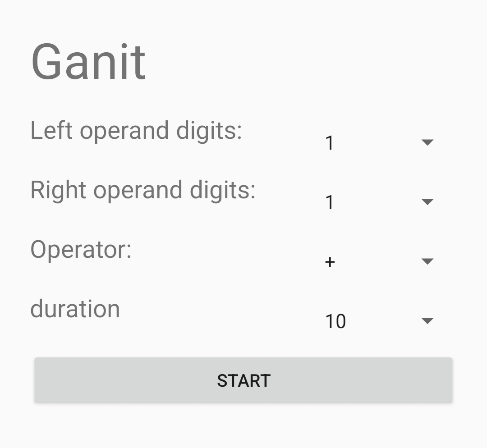
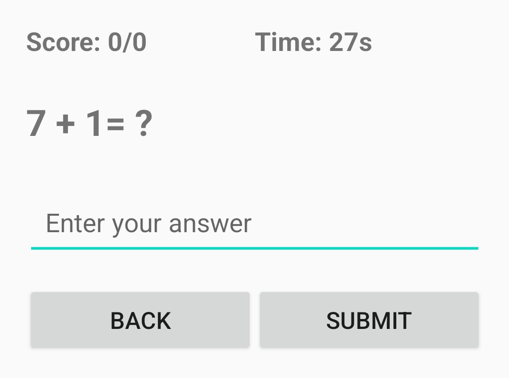
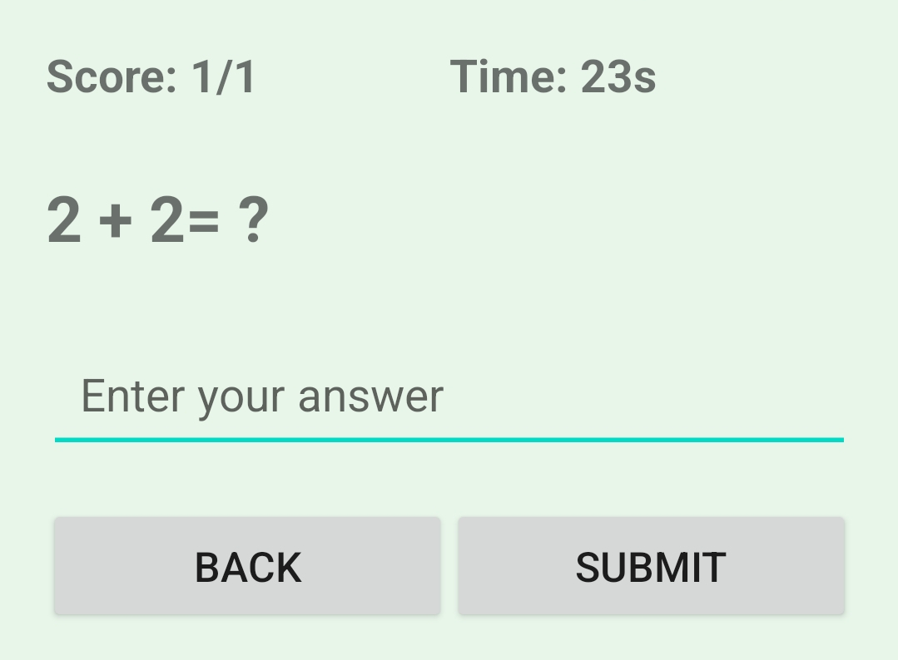
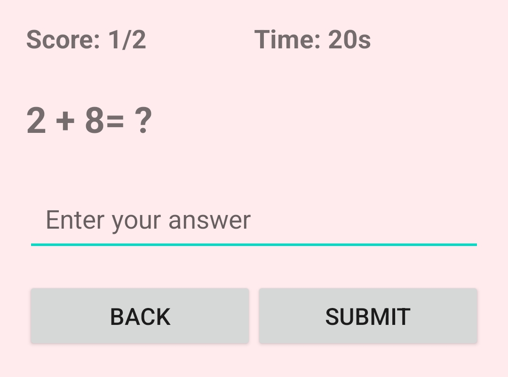
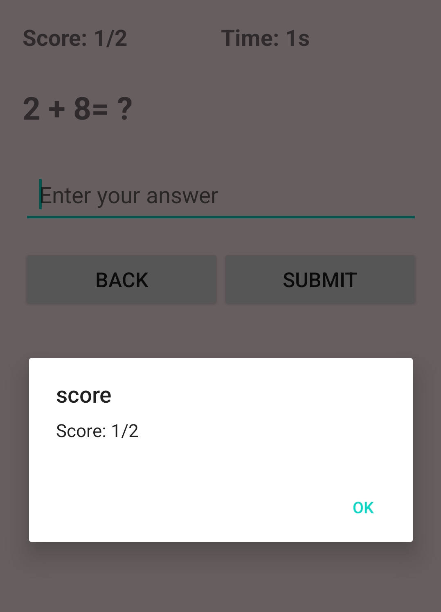

# Ganit - गणित - Maths Quiz

A simple (currently) Android app for praticing maths, like addition, substraction, multiplication and ~~division~~.

User is provided questions with two operands and an operator. App will continue to generate questions until either timer passes, or the user quits.

Score is displayed for the current quiz session.

## Configuration
### Operand lengths
User can configure the length of digits of either iof the numbers, 1,2 or 3.

### Operator
User can configure the operator quiz should be on. One of addition, substraction, mulitplication or ~~division~~.

### Timer
One of 10, 30, 60 or 120 seconds. Time for the quiz session.

## Screenshots
### Configure Screen

### First Question

### Previous answer was correct

Notice the background color changes to pastel green for indicating this.

### Previous answer was incorrect

Notice the background color changes to pastel red for indicating this.

### Score 

